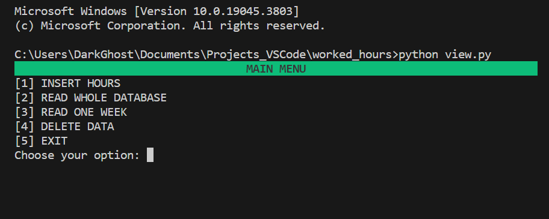
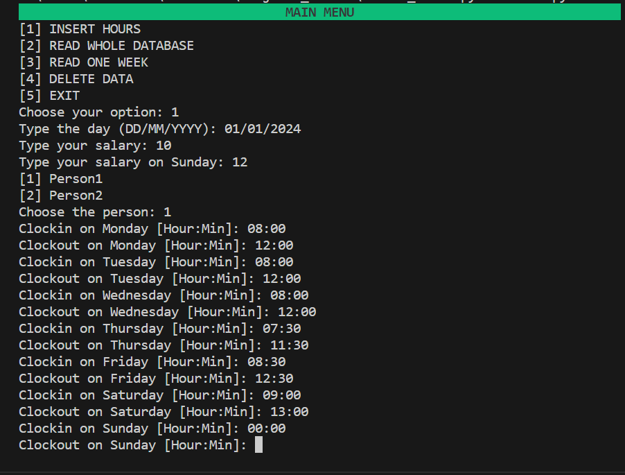
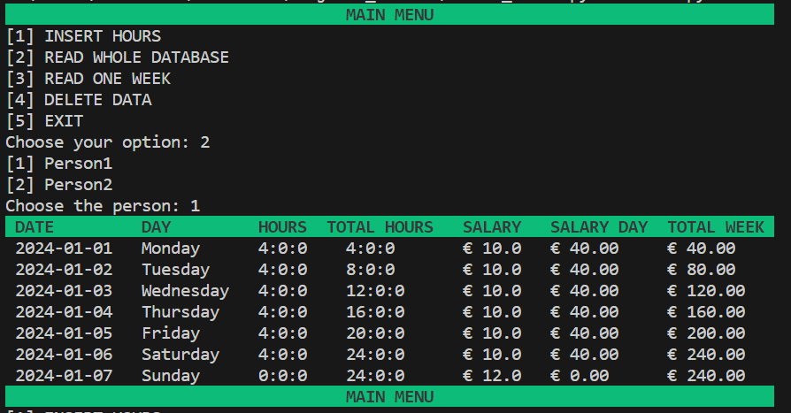

<h1 align="center">WORKED HOURS DATABASE</h1>

### 📝 DESCRIPTION

<p align="justify">This is a Python program that functions as a time bank. It allows you to log your check-in and check-out times throughout the week, calculates your pay based on these hours, stores your hours, and provides a total summary of hours and earnings for the entire week. It's a handy tool for time management and tracking income.


### ⏭️ TABLE OF CONTENTS
1. Description
2. Requirements
3. Run the project
4. Contribute
5. Screenshots

### 💻 REQUIREMENTS
- [Python3](https://docs.python.org/3/)
- [SQLAlchemy](https://www.sqlalchemy.org/library.html)
- [VisualCode](https://code.visualstudio.com/docs)


### 🚀 HOW TO RUN THE PROJECT
```bash
You will download the model.py, view.py and controller.py.
Run the script view.py and it will create the database automatically.
```


### 📫 HOW TO CONTRIBUTE
```bash 
# Fork this repository:
By clicking on the fork button on the top of this page. This will create a copy of this repository in your account.

# Clone this project:
git clone https://github.com/BLUCASS/Worked_Hours_Database

# Create a branch using the command:
git checkout -b your-new-branch-name

# Make the changes and commit them:
git commit -m "commit-message"

# Send them to the original branch:
git push file-origin project-name / local
```

### 📸 SCREENSHOTS
<br>
<br>

